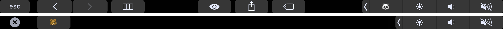

# Terminal Cancer
# BASED ON Touch Bär

Terminal Cancer has the same license as Touch Bär.

by @f4bul1z3r

pls be careful i dont guarantee this shit even works

Touch the middle finger button that appears in your control strip to open the list of commands

use the interface to add , edit , and remove commands.

commands are stored in a file that is named with a number

script format

1st line: #Command name (newline)
rest of lines: your script that is executed

the string on the same line as the hastag on the first line is parsed within the app and is used as the text on the touch bar button to identify which command you are executing.




Touch Bär uses **undocumented, private API** to add a Touch Bar button to the Control Strip on the right-band side of the keyboard.

```objc
DFRElementSetControlStripPresenceForIdentifier(NSString *, BOOL);
DFRSystemModalShowsCloseBoxWhenFrontMost(BOOL);

+[NSTouchBarItem addSystemTrayItem:]
+[NSTouchBar presentSystemModalFunctionBar:systemTrayItemIdentifier:]
```

## # Touch Bär Author

Alexsander Akers, me@a2.io

## License

Touch Bär is available under the MIT license. See the LICENSE file for more info.


